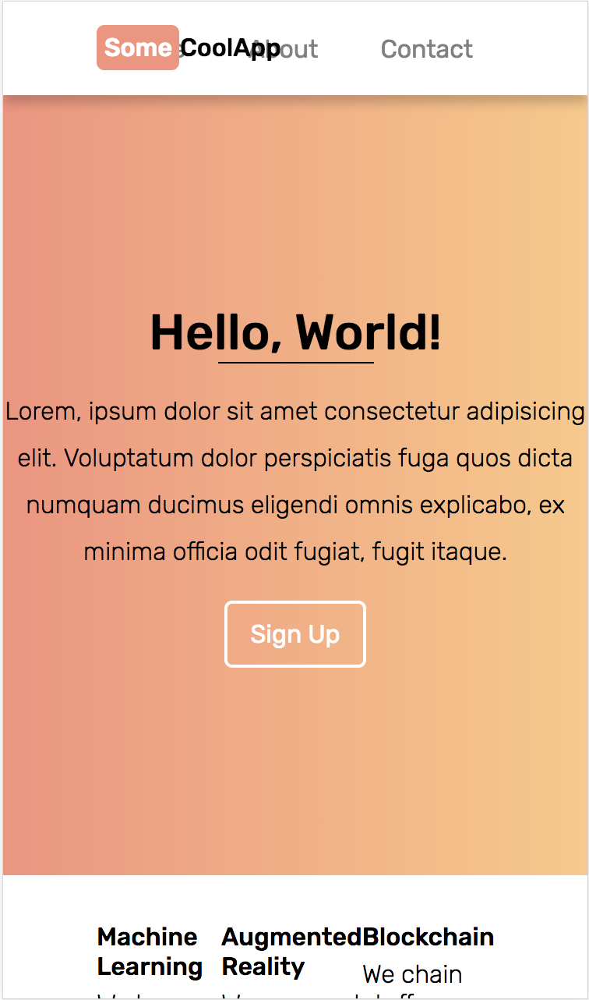
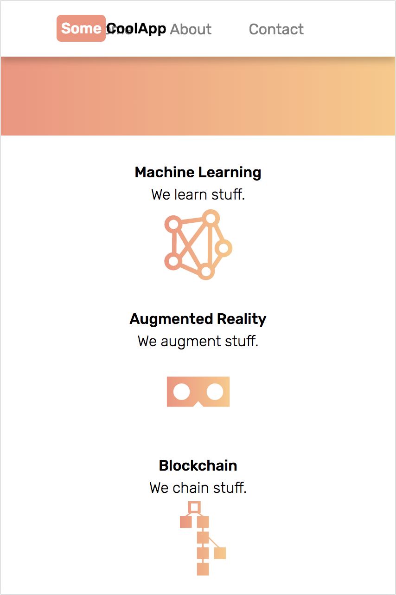
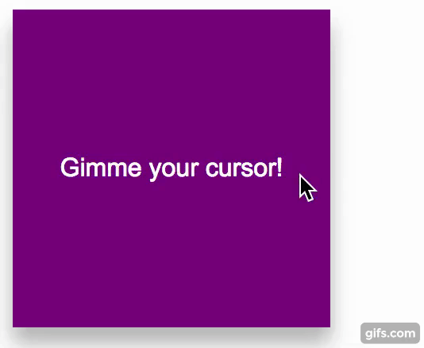
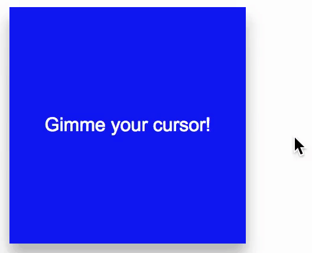

# Web Development Workshop 2018
Welcome to Open Web's web development workshop! This workshop will teach you how to use CSS, HTML and Javascript to create a basic functioning website that you can use in your hackathon projects.

Now that you know how to use CSS, HTML and Javascript, the following content will cover topics that we probably did not have the time to cover.

## Responsive Design
When you create a website that is [responsive](https://www.w3schools.com/html/html_responsive.asp), you are creating a website that looks good in all devices. You probably use responsive websites daily but do not notice it. It's become somewhat of an expectation in the frontent development industry and when your website is not responsive, your users will immediately notice. (It's why frameworks like [Bootstrap](https://getbootstrap.com/), [Foundation](https://foundation.zurb.com/) and [Skeleton](http://getskeleton.com/) are so popular when creating a website.)

Currently, the website we made in this workshop is **NOT** responsive. This is how it looks on a medium-size mobile phone: 


As you can see, the content is zoomed out and there's a lot of wasted space at the bottom that we could have used to space things out. Making our website responsive will fix this issue and improve the user experience.

There are really only 2 things to keep in mind when making a website responsive:

1. Using [viewport meta](https://css-tricks.com/snippets/html/responsive-meta-tag/) tag
2. Using [CSS media queries](https://www.w3schools.com/css/css3_mediaqueries_ex.asp) to add conditionals to your stylings.

#### Viewport Meta tag
Metadata refers to a small snippet of information about some data (data about data). 

For instance, if you take a picture on your smartphone, it will likely carry metadata about where the picture was taken and what time it was taken.

HTML documents can also carry metadata about the author, its description, or about the specific configuration that web browsers should use in order to display the website in its best format.

**viewport** is the specific type of meta tag that allows us to do this and although you can read up on different attributes you can declare, the following code is usually enough.  

```html
<meta name="viewport" content="width=device-width, initial-scale=1">
```

**name** attribute is where we specify what type of metadata we are declaring.
**content** attribute is where we tell the browser what width, height and scaling it should use.

By writing **width=device-width**, we are saying "hey browser, set the width of this website to the width of the device you are accessing this website from!"

If the web browser is running on a laptop, the browser might say "Alright, I gotcha. I will set the width of this website to 1024 pixels." Whereas a browser running on your iPhone might say "Got it. I will set it to 375 pixels."

Try adding this meta tag to the website we created in the workshop.

With this very simple addition, your website is already 80% responsive and your users are going to have a better time learning about your application.

In case you are curious, this is how our website now looks on a medium-sized mobile device:



The content is now zoomed in enough for us to read and there's not much wasted space either. This is good. We want this.

But as most of you will have probably noticed already, the website now has overlapping content that makes it harder to read. 

For instance, our awesome company logo at the top right is overlapping the link to our About page. In addition, the 3 features at the bottom of the page are now squashed together. This is not good.

To fix this, we need to introduce **media query** to our CSS.

#### CSS Media Query

There are obviously hundreds of CSS attributes and HTML tags that we did not have the time to show you. Media query is probably among the Top 10 CSS concept that I use **ALL THE TIME** in my personal projects and it looks like this:

```css
@media (max-width: 375px) {
    .hero {
        height: 200px;
        width: 50%;
    }

    /* etc... */
}
```

Don't be freaked out by the **@** sign in CSS. It rarely shows up and out of the 20-something [at-rules](https://developer.mozilla.org/en-US/docs/Web/CSS/At-rule), you'll only probably use 5 of them.

The above statement says "apply the following stylings if the device width is at most 375 pixels." 375px in our example is referred to as a **breakpoint**. It's simply a transition point between media queries. If your phone is 200px wide, then the above stylings will get applied. However if your phone is *376px* wide and therefore *outside of the breakpoint*, then these stylings will simply be ignored.

What's really cool is that media-queries can be layered. You can specify a specfic style change that gets applied at 700px or less and another at 300px or less. If a device with a width of 200px accesses the website, both 700px media-query and 300px media-query will get applied.

Going back to our website, we noticed before that when we added the viewport meta tag, the brand logo overlapped the menu and the 3 features got squashed together. We can use some simple media-query to fix these.

Here's the basic workflow to fix some formatting issues in responsive design:

1. Play around with different sizes to find where the issue occurs.
2. Set a media query breakpoint (if one does not yet exist).
3. Add some custom stylings to fix the issue.

Let's try to fix how the three features at the bottom are all squashed and nasty-looking. First, I open up my chrome developer tools and look for that sweet sweet breakpoint.


Although I can try and pinpoint exactly at what width the three feature boxes begin to overlap, it's usually not worth stressing over specifics when it comes to breakpoints. So I pick 650px here as our breakpoint and add the following rule:

```css
@media (max-width: 650px) {
    #features {
        flex-direction: column;
    }

    #features .feature {
        flex: auto;
    }
}
```

The actual rule I wrote here is irrelevant in this section but basically at device width less than 650px, the features will be stacked vertically instead of horizontally.

This is what that looks like:



The menu is still messed up but the changes I implemented are a little bit more complex that requires more CSS and a little bit of Javascript. To sum up the changes I made, at 650px breakpoint, I hid the the links and instead added a [hambuger button](https://en.wikipedia.org/wiki/Hamburger_button) that opens a menu when it's clicked. You can headover to the [responsive branch](https://github.com/openwebbu/intro-webdev-2018/tree/responsive) of this workshop and see what changes I added to the CSS and JS.

If you are really curious about what I did and want to know more, shoot Open Web BU an [email](mailto:openweb@bu.edu).

But basically, you now know most of what it takes to exponentially improve the user experience of your website. Yay!

## Transitions and Animations

Depending on time, we may have had a little bit of time to touch on transitions. If we did, great, if not, great. Either way, we did not touch on everything there is about making your website more interactive.

Animations and transitions can bring your website to life and simply changing the color of a button when a user hovers on it can indicate to the user that a box on the website can be clicked or dragged.

**Basically, interactivity is not necessary but will improve the user experience.**

#### Transitions
As the word implies, transitions are used to transition from one state to another. A button on a website might be one "state" and when it is clicked on, it transitions to another "state."

Here's an example:


and here's the CSS for it:
```css
#box {
    /* Just some basic styling stuff */
    color: white;
    height: 200px;
    width: 200px;
    display: flex;
    justify-content: center;
    align-items: center;
    box-shadow: 0 10px 20px 0 rgba(0, 0, 0, 0.3);

    background-color: blue;
}

#box:hover {
    background-color: purple;
}
```

(It doesn't matter a whole lot here but you might be curious about **:hover** selector in the above code. This is referred to as "pseudo-element" and is very useful once you start making complex websites. Read about it [here](https://www.w3schools.com/css/css_pseudo_elements.asp))

As you can see, when the cursor is outside of the box, it is in its "rest" state. When the cursor is "hovering" (above the box), it is in its "hover" state and the background color changes to purple.

In the above example, the change in background color happens instantly. Declaring a transition in CSS allows us to customize this behavior.

By adding the below CSS code to the box, we can smooth out the color change:

```css
#box {
    ...

    transition: background-color 1s ease-in-out;
}
```



Let's breakdown the new code into pieces.

- **transition** is the CSS attribute we're using, nothing scary here.
- **background-color** is a CSS attribute. In this context, we're declaring which CSS attribute the transition should get applied to. If you have multiple attributes that are changing (e.g. background-color, color, height, width and so on) and you want to just apply one transition to all of them then you can use the keyword **"all"** here.
- **1s** is how long the transition should take to complete. Typically, 1 second transition is too long but I exaggerated it for the sake of education. 0.2s to 0.5s is recommended.
- **ease-in-out** is what is called an "easing function." Easing functions specify the rate of change over time. When you start driving, you don't instantly accelerate to max speed and instantly come to a halt. In real life, change happens gradually. Easing functions allow you to specify this behavior. There's about 30 different easing functions and you can see them in action [here](http://easings.net/).

If easing function is something that you don't really care about (and you really shouldn't until you're at the final stages of your development...) then you can omit the easing function parameter and leave it at:

```css
#box {
    ...

    transition: background-color 1s;
}
```

By default, transition has a linear easing function which means that the transition will occur in constant time.

#### Animations
I can't think of an easy way to explain the difference between transitions and animations so here's a quote from [stackoverflow](https://stackoverflow.com/questions/20586143/css-animation-vs-transition).

> A transition **is an animation**, just one that is performed between two distinct states - i.e. a start state and an end state. Like a drawer menu, the start state could be open and the end state could be closed, or vice versa.
<br /><br />
If you want to perform something that **does not** specifically involve a start state and an end state, or you need more fine grain control over the keyframes in a transition, then you've got to use an animation.

The above quote sums it up perfectly. 